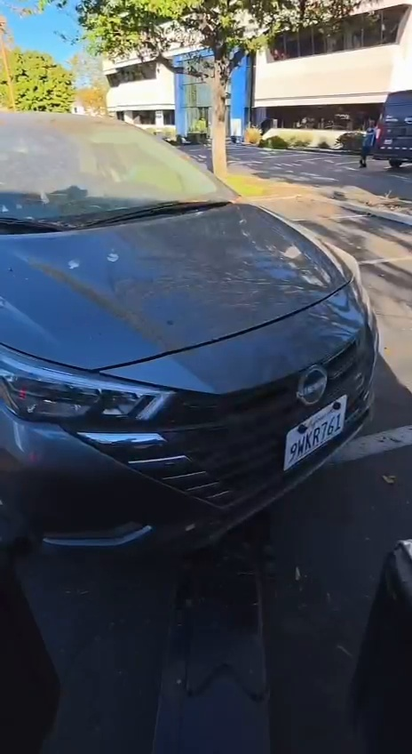
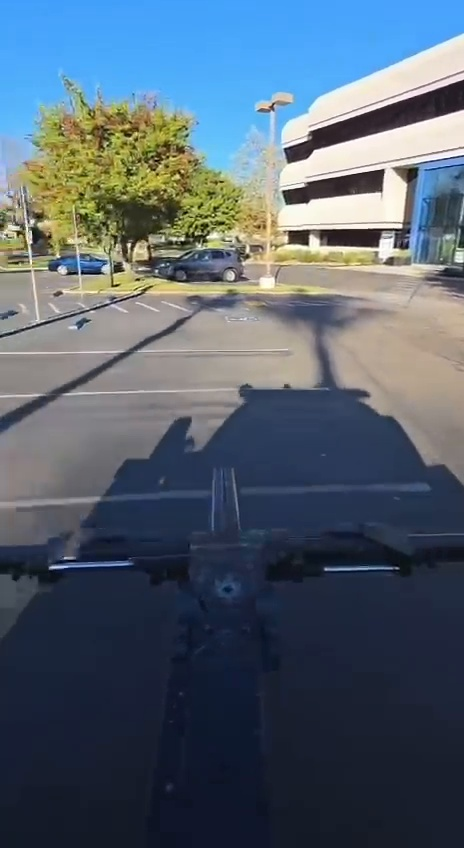
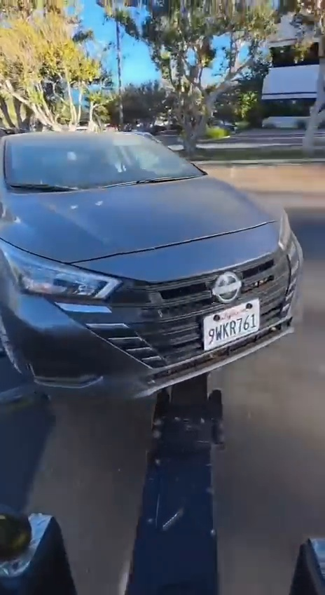
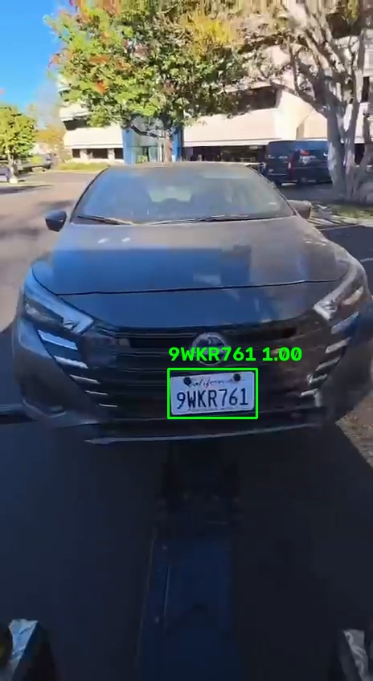

# Have I Been Towed? — TowTrace AI

A hackathon-ready tow detection demo that combines a **FastAPI backend**, **computer vision / OCR pipeline**, **SQLite storage**, and a lightweight web interface. Upload tow-truck footage, let the CV pipeline identify a likely towed vehicle's plate, save the detection, and search that plate from the public-facing lookup page.

<p align="center">
  
</p>

## What it does

1. A tow-truck video is uploaded from the **Detection** page.
2. The backend sends the video through the CV pipeline.
3. The pipeline detects plates, reads them with OCR, tracks them across frames, estimates tow-truck/camera motion, and uses repeated votes to reduce bad one-frame reads.
4. Accepted detections are stored in SQLite with confidence, vote count, and a snapshot.
5. The **Evaluation** page shows accepted detections.
6. The homepage lets a user search a plate and see its latest tow record.

## Demo

### Sample tow footage

| Start | Mid-video | Later frame |
| --- | --- | --- |
|  |  |  |

### Accepted plate snapshot

<p align="center">
  
</p>

## Tech stack

- **Frontend:** HTML, CSS, vanilla JavaScript
- **API:** FastAPI + Uvicorn
- **Database:** SQLite + SQLModel
- **Computer vision:** OpenCV + FastALPR / YOLO-based plate detection
- **OCR:** FastALPR OCR output with multi-frame voting
- **Video analysis:** plate tracking + background optical-flow motion estimation

## Repository structure

```text
HaveIBeenTowed/
├── frontend/
│   ├── index.html             # Plate lookup page
│   ├── detection.html         # Upload video for CV analysis
│   └── evaluation.html        # Review accepted detections
│
├── backend/
│   ├── main.py                # FastAPI app + database/API routes
│   ├── requirements.txt       # Python dependencies
│   └── cv/
│       └── tow_cv_only.py     # CV/OCR/tow-detection pipeline
│
├── data/
│   ├── towtrace.db            # Demo SQLite database
│   ├── snapshots/             # Accepted detection images
│   └── uploads/               # Temporary uploads (gitignored)
│
├── demo/
│   └── tow_test.mp4           # Included test video
│
├── docs/images/               # Images used by this README
├── start_towtrace.py          # Cross-platform launcher
├── start_towtrace.bat         # Windows one-click launcher
├── start_towtrace.ps1         # PowerShell launcher
└── test_cv.bat                # Windows CV-only test
```

## Quick start — Windows

### 1. Clone the repository

```powershell
git clone <your-repository-url>
cd HaveIBeenTowed
```

### 2. Start the app

Double-click:

```text
start_towtrace.bat
```

Or run:

```powershell
python start_towtrace.py
```

On the first launch, the launcher creates `.venv`, installs the dependencies, starts FastAPI, and opens the app in your browser.

Open manually at:

```text
http://127.0.0.1:8000
```

## Manual setup

Python 3 is required.

```bash
python -m venv .venv
```

### Windows PowerShell

```powershell
.\.venv\Scripts\Activate.ps1
pip install -r backend\requirements.txt
python -m uvicorn backend.main:app --host 127.0.0.1 --port 8000
```

### macOS / Linux

```bash
source .venv/bin/activate
pip install -r backend/requirements.txt
python -m uvicorn backend.main:app --host 127.0.0.1 --port 8000
```

Then visit `http://127.0.0.1:8000`.

## Test the CV pipeline

First start the backend, then open a second terminal from the repository root.

### Windows

```powershell
.\.venv\Scripts\Activate.ps1
python backend\cv\tow_cv_only.py demo\tow_test.mp4 --debug
```

Or double-click `test_cv.bat`.

### macOS / Linux

```bash
source .venv/bin/activate
python backend/cv/tow_cv_only.py demo/tow_test.mp4 --debug
```

When the pipeline accepts a plate as the likely towed vehicle, it can POST the tow record to the running backend at `/tows`.

## Web pages

| Page | Route | Purpose |
| --- | --- | --- |
| Home | `/` | Search a license plate and view its latest tow record |
| Detection | `/detection` | Upload a video and run the tow-detection pipeline |
| Evaluation | `/evaluation` | Review accepted detections and snapshots |
| Health | `/health` | Confirm that the backend is running |

## API endpoints

| Method | Endpoint | Purpose |
| --- | --- | --- |
| `GET` | `/health` | Backend health check |
| `POST` | `/tows` | Create a tow record |
| `GET` | `/tows` | Get the 50 most recent tow records |
| `GET` | `/tows/{plate}` | Find the most recent tow for a plate |
| `POST` | `/detections/analyze` | Upload and analyze a video |
| `GET` | `/detections` | Get detection history |
| `DELETE` | `/detections` | Clear detection history |

## How the computer vision works

The CV pipeline is intentionally more than a single OCR call:

- detects candidate license plates with FastALPR;
- filters detections by size/region when configured;
- tracks plates across analyzed video frames;
- estimates background motion using OpenCV optical flow;
- compares plate motion with tow-truck/camera motion to find plates that remain rigid relative to the truck;
- combines repeated OCR reads using voting instead of trusting one frame;
- stores the strongest snapshot for an accepted plate.

This makes the project closer to a **tow-event detection pipeline** than a basic license-plate reader.

## Notes

- Uploaded videos are kept only temporarily during browser-based analysis.
- Accepted snapshots are saved under `data/snapshots/` and served by the backend.
- The included SQLite database and sample detection are demo data and can be replaced with a fresh database for deployment.
- The current demo analyzes uploads synchronously. A production deployment would normally move long-running CV work to a background worker/queue and use durable object storage for videos and snapshots.

## Future improvements

- SMS notification when a vehicle is detected as towed
- authentication for tow operators
- cloud object storage for footage and snapshots
- asynchronous/background video processing
- map integration for tow-yard destination and vehicle pickup
- improved plate-region validation and model evaluation metrics
- containerized deployment with Docker

## Hackathon use

For a demo, the simplest flow is:

1. Run `start_towtrace.bat`.
2. Open **Detection**.
3. Upload `demo/tow_test.mp4`.
4. Wait for analysis to finish.
5. Open **Evaluation** to show the accepted snapshot.
6. Search the accepted plate on **Home** to demonstrate the user lookup experience.

---

Built as a computer-vision + full-stack prototype for detecting and surfacing tow events from video.
